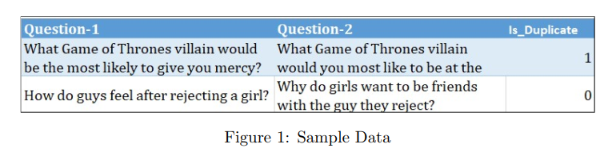
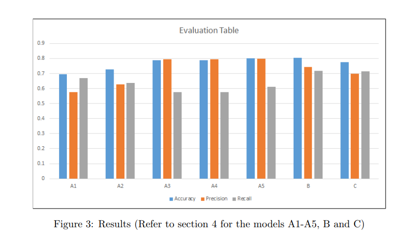

# Question-De-duplication

This project is aimed at exploring different ways of text representation which would in turn be used to solve the Question De-duplication problem posed on Kaggle by Quora. We contribute by exploring Natural Language feature engineering and we demonstrate that well-engineered Natural Language features can improve model performance. While the base model is a Random Forest model, we extend our work to more advanced methods such as using word embeddings from GloVe and sentence embeddings from InferSent, and also the LSTM network.

### Data
The dataset consists of 400,000 pairs of questions along with the label stating if the question pair is a duplicate or not. A sample of the dataset is shown below:

### Methods

Our incremental approach to the use of Natural Language features progresses in the following manner:
1. Model A1: Levenshtein Distance and String Jaccard Coefficients
2. Model A2: A1 + Part of Speech and Named Entities Features
3. Model A3: Bag of Words Features
4. Model A4: TF-IDF Features
5. Model A5: A2 + TF-IDF Features

Next, we explored word and sentence embeddings with neural networks, i.e. our model B and model C. This fulfils our objective of exploring advanced methods of text representation and textual feature extraction. At the same time, we are aware that the neural networks we used are not complex, so the results will not be as superior as deep networks.

1. Model B: GloVe Word Embeddings + LSTM
2. Model C: Sentence Embeddings + 3-layer Neural Network

### Evaluation

### General Instructions

	1. To run infersent notebbok, you have to first clone the infersent repo by facebbok research:
			- git clone https://github.com/facebookresearch/InferSent.git

	2. You would also need fastText word embeddings
			- can be downloaded from here https://fasttext.cc/docs/en/english-vectors.html

	3. To generate string features, we use libraries like fuzzywuzzy and python-Levenshtein
			- pip install fuzzywuzzy
			- pip install python-Levenshtein
		They help in very efficient calculations of Levenshtein distance, when compared to other libraries

	4. Nlp features are generated using the library: 
			- Spacy
	5. Deeplearning part is explored with the library:
			- Keras (Tensorflow backend)
	6. XGBoost is another algorithm we used but for efficient working of the algorithm, multiple parameters in the system environment are needed to be tuned:
			- We recommend using Randomforest or Simple DNN for InferSent experiments which are also included in the same notebook.
    7. Lastly, simple install and import any other required relevant libaries if prompted
    
	A typical python 3.x installation (with Anaconda could be much easier) along with Scikit-learn library should be enough for any other requirement.
